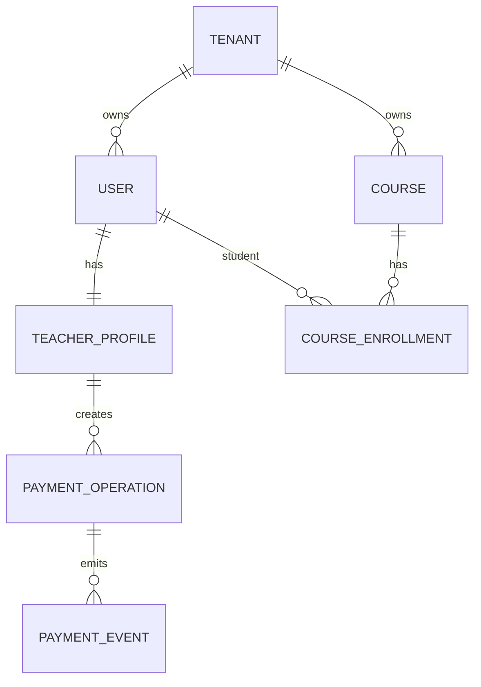

# Modelo de datos

## Entidades principales

## PaymentOperation

Representa una operacion de cobro contra un proveedor.

Campos clave:

- `teacherId`
- `studentUserId`
- `courseId`
- `provider`
- `flowType`
- `amount`
- `currency`
- `checkoutUrl`
- `providerReference`
- `status`
- `rawResponse`
- `reconciliationStatus`

## PaymentEvent

Representa un evento auditable.

Campos clave:

- `operationId`
- `eventType`
- `statusFrom`
- `statusTo`
- `rawPayload`
- `createdAt`

## TeacherProfile

Concentra datos del profesional:

- display name
- access token de Mercado Pago
- API keys de otros proveedores
- alias/banco para transferencia manual

## Course

Puede modelar curso, grupo, plan o servicio recurrente.
