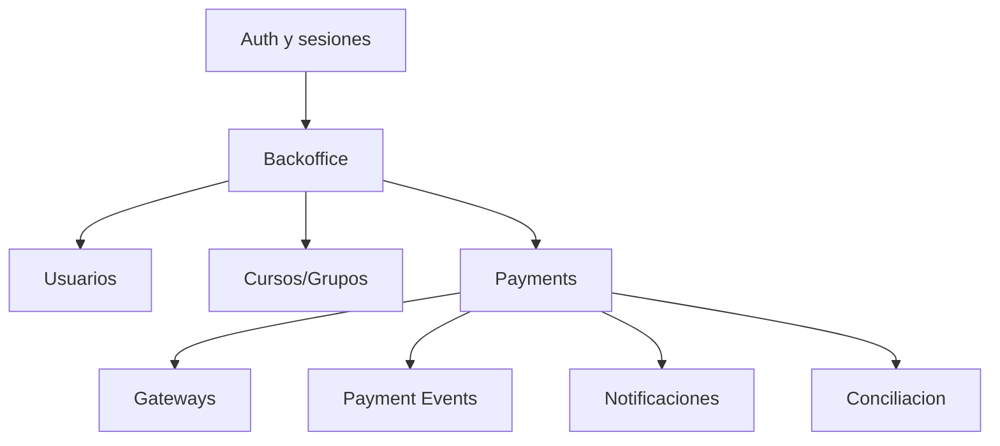

# Plataforma

MiCuota organiza el flujo financiero-operativo de servicios humanos recurrentes.

## Dominios principales

## Capas

| Capa | Responsabilidad |
| --- | --- |
| Frontend estatico | Login, dashboards, backoffice, pago publico. |
| REST API | Contratos HTTP, validacion y autorizacion por token. |
| Servicios de dominio | Orquestacion de pagos, usuarios, cursos, metricas. |
| Gateways | Integracion con Mercado Pago, Prometeo y otros PSPs. |
| Persistencia | Entidades JPA y migraciones Flyway. |

## Principio de producto

La interfaz debe sentirse simple para el profesional. La complejidad de proveedores, estados, conciliacion, eventos y reportes queda del lado de MiCuota.

## Principio tecnico

El monolito debe permanecer modular: entidades y servicios claros por dominio, con eventos de pago como base para evolucionar hacia workflows mas complejos.
