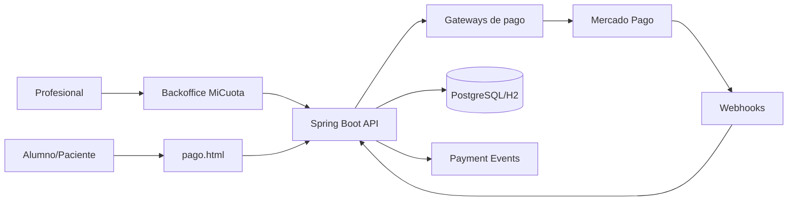

# MiCuota Docs

MiCuota es una plataforma para ordenar cobros periodicos de profesionales independientes y pequenos centros: alumnos o pacientes, cuotas, links de pago, suscripciones, recordatorios, conciliacion y trazabilidad.

Esta documentacion esta pensada para equipos de producto, integradores, soporte y operaciones. La estructura toma como referencia portales fintech modernos: empezar rapido, entender la plataforma, integrar APIs y operar con confianza.

## Que puedes hacer con MiCuota

- Registrar tenants, profesores y alumnos.
- Crear cobros unicos y suscripciones.
- Generar links y QR de pago.
- Procesar pagos con Mercado Pago y otros gateways.
- Recibir callbacks y webhooks.
- Consultar timeline auditable de cada cobro.
- Medir salud de cobranzas, mora y recupero.

## Primer recorrido recomendado

1. Lee [Get Started](getting-started/get-started.md).
2. Levanta el entorno con [Desarrollo local](operations/local-development.md).
3. Crea tu [primer cobro de prueba](getting-started/first-payment.md).
4. Configura [webhooks](getting-started/webhooks.md).
5. Revisa el [ledger y timeline](core/ledger.md).

## Arquitectura en una frase

MiCuota separa la experiencia simple del profesional de una capa interna de pagos, ledger, conciliacion, notificaciones y analitica.

## Estado actual

La plataforma usa Spring Boot 3.5, Java 17+, JPA, APIs REST y frontend estatico. La autenticacion se maneja con tokens HMAC propios enviados en `X-Auth-Token`.
