# Sequence Diagrams - MVP

Documento técnico consolidado para revisar los flujos principales de extremo a extremo.

## 1. Profesor se loguea

Objetivo: autenticar al profesor y redirigirlo automáticamente a su dashboard según rol.

Actor principal: Profesor.

Endpoint: POST /api/auth/login

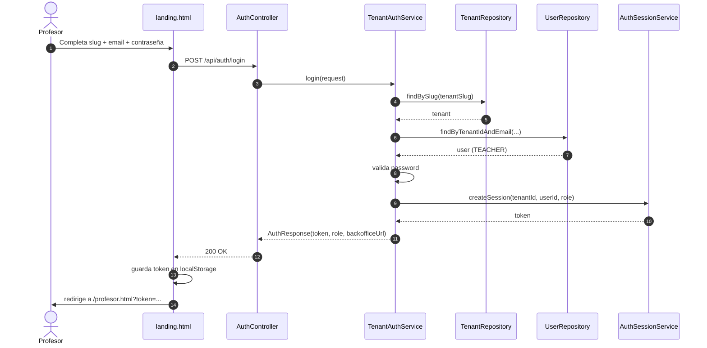

## 2. Configuración básica del profesor

Objetivo: dejar lista la base operativa (usuario profesor, perfil profesional y curso asignado).

Actor principal: Tenant Admin.

Endpoint:
- POST /api/backoffice/users
- POST /api/backoffice/courses

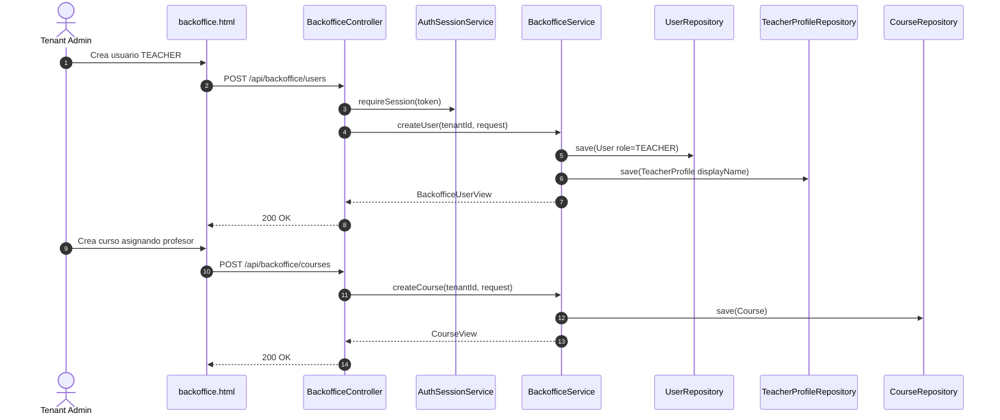

## 3. Crear pago único

Objetivo: generar una operación ONE_TIME con checkout del proveedor y persistencia en estado CREATED.

Actor principal: Profesor.

Endpoint: POST /api/backoffice/payments/one-time

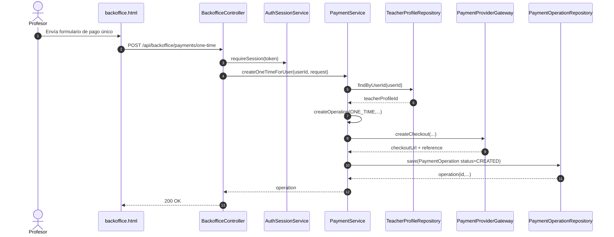

## 4. Crear suscripción

Objetivo: generar una operación SUBSCRIPTION con checkout del proveedor y persistencia en estado CREATED.

Actor principal: Profesor.

Endpoint: POST /api/backoffice/payments/subscriptions

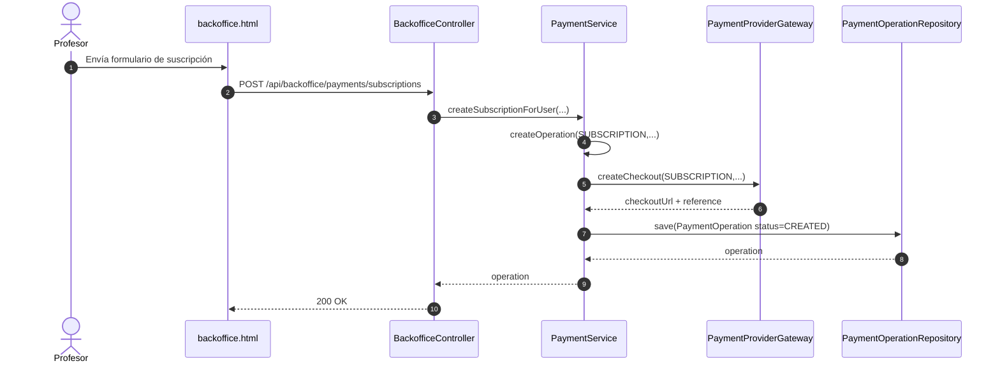

## 5. Profesor ve enlace y QR

Objetivo: mostrar link de app, link proveedor y QR para compartir el cobro.

Actor principal: Profesor.

Endpoint: GET /api/backoffice/payments/by-course?courseId=...

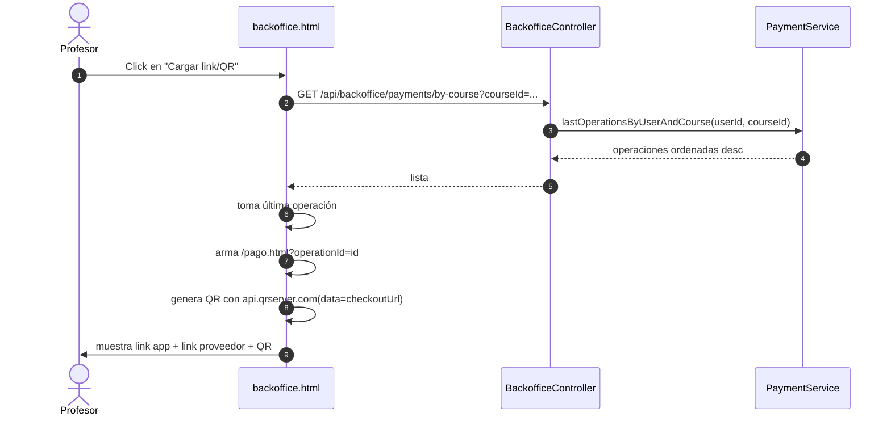

## 6. Alumno paga

Objetivo: consultar operación pública y completar el pago en checkout externo.

Actor principal: Alumno.

Endpoint: GET /api/public/payments/{operationId}

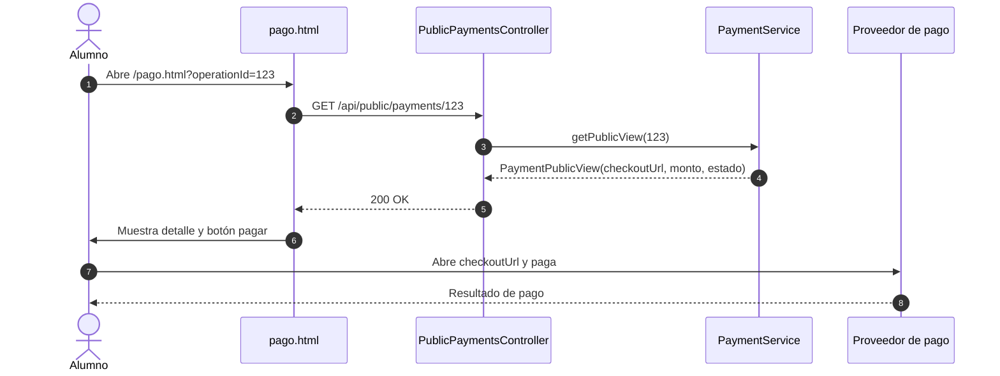

## 7. Callbacks mínimos

Objetivo: actualizar el estado de la operación según resultado del proveedor.

Actor principal: Proveedor de pago.

Endpoint:
- GET /api/callbacks/success?operationId=...
- GET /api/callbacks/pending?operationId=...
- GET /api/callbacks/failure?operationId=...

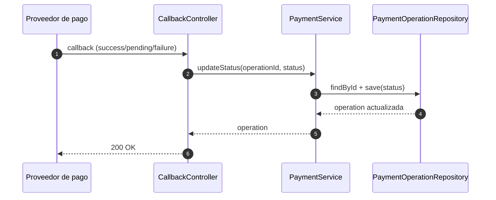

## 8. Evolución sin romper MVP

Objetivo: extender proveedores y observabilidad manteniendo contratos actuales.

Actor principal: Equipo de tecnología.

Endpoint: no aplica (evolución de arquitectura interna).

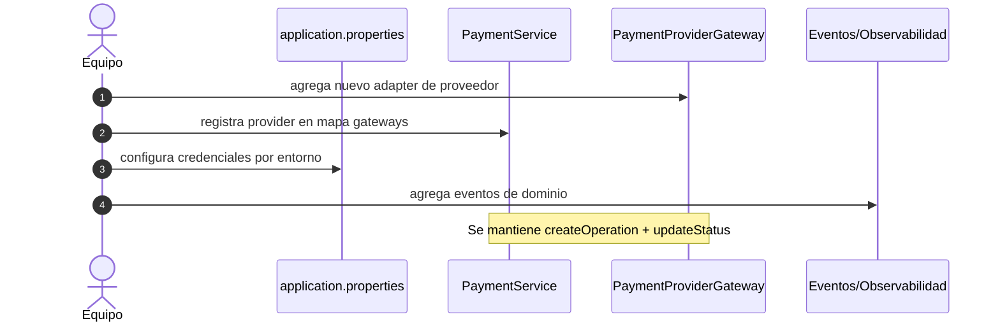

---

## V2 futura (recomendada)

### A. Flujo con MercadoPago real

Objetivo: reemplazar simulación mínima por integración completa (preferencias, metadata, webhooks firmados, conciliación).

Actor principal: Proveedor MercadoPago.

Endpoint: a definir en diseño V2.

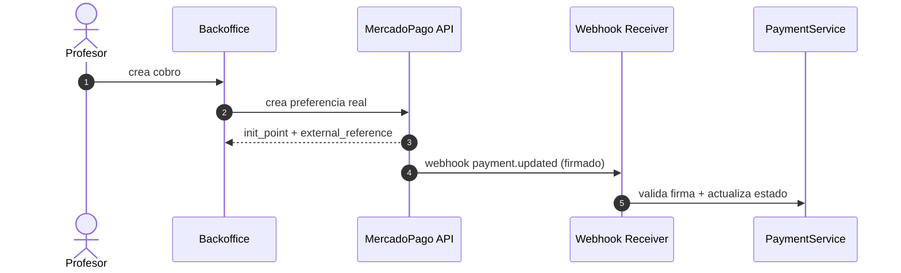

### B. Flujo cuenta maestra vs cuenta del profesor

Objetivo: soportar dos estrategias de cobro (master account o subcuenta/profesor) por tenant y/o curso.

Actor principal: Tenant Admin.

Endpoint: a definir en diseño V2.

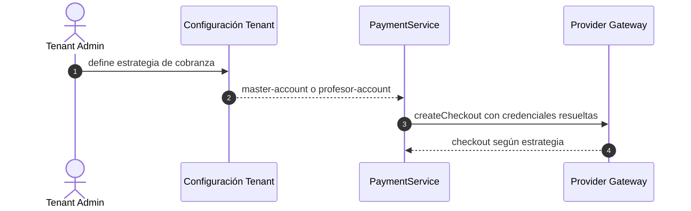

### C. Webhooks reales en lugar de callbacks mínimos

Objetivo: pasar de callbacks GET manuales a webhooks idempotentes, firmados y auditables.

Actor principal: Proveedor de pago.

Endpoint: POST /api/webhooks/{provider} (propuesto V2)

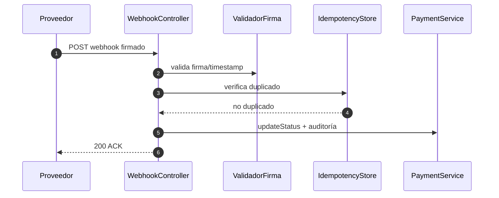
